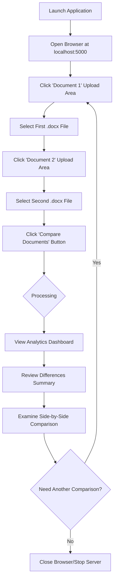
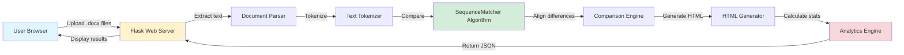

# xsukax Word Document Comparison Tool


A powerful, privacy-focused web application for side-by-side comparison of Word documents with intelligent diff highlighting, comprehensive analytics, and multilingual support including Arabic and RTL languages.

## 📋 Project Overview

The xsukax Word Document Comparison Tool is a self-contained Flask-based web application designed to provide detailed, visual comparisons between two Microsoft Word (.docx) documents. Built with privacy and security at its core, this tool processes all documents locally on your machine without transmitting data to external servers. It features an elegant GitHub-inspired interface that presents word-level differences with color-coded highlighting, line-by-line tracking, and detailed analytics to help users quickly identify changes, additions, and deletions between document versions.

The application excels in scenarios requiring document revision tracking, contract comparisons, academic paper revisions, translation verification, and any workflow where understanding precise textual changes is critical. Its support for Arabic and other RTL languages makes it particularly valuable for multilingual documentation workflows.

## 🔒 Security and Privacy Benefits

This application prioritizes user privacy and data security through a local-first architecture:

- **Complete Local Processing**: All document parsing, comparison, and analysis occur entirely on your local machine. No document content is ever transmitted to external servers or third-party services.

- **No Data Persistence**: The application does not store, cache, or save any uploaded documents. Files are processed in memory and discarded immediately after comparison results are generated.

- **Zero External Dependencies for Processing**: Document comparison logic uses only local Python libraries without making outbound network requests during analysis.

- **No Tracking or Analytics**: The application does not implement any user tracking, analytics collection, or telemetry. Your usage remains completely private.

- **Open Source Transparency**: As an open-source project, the entire codebase is available for security auditing and verification of privacy claims.

- **Isolated Execution**: Running on localhost ensures that only users with physical or authorized remote access to your machine can access the application.

- **No Account Requirements**: No registration, authentication, or personal information is required to use the tool.

## ✨ Features and Advantages

### Core Capabilities
- **Side-by-Side Visual Comparison**: Dual-panel interface displaying both documents simultaneously with synchronized scrolling
- **Word-Level Diff Highlighting**: Precise identification of changes at the individual word level rather than entire paragraphs
- **Comprehensive Change Categorization**: Clear distinction between added content (green), removed content (red), modified content (yellow), and unchanged content
- **Line Number Tracking**: Easy reference to specific lines containing differences for team collaboration and revision discussions
- **Detailed Analytics Dashboard**: Real-time statistics showing similarity percentage, total words analyzed, and counts of added/removed/modified words

### Technical Advantages
- **Multilingual Support**: Full support for Arabic, Hebrew, and other RTL (right-to-left) languages with automatic direction detection
- **Single-File Deployment**: Entire application contained in one Python file for simplified distribution and deployment
- **GitHub-Inspired Modern UI**: Clean, professional interface with responsive design and accessibility considerations
- **Efficient Diff Algorithm**: Uses Python's `SequenceMatcher` for accurate and performant document comparison
- **Smart Text Extraction**: Fallback mechanisms ensure reliable text extraction from various .docx file formats

### User Experience
- **Instant Feedback**: Fast processing with visual loading indicators
- **Intuitive Color Legend**: Clear visual guide for understanding difference types
- **Differences Summary Panel**: Quick overview showing which specific lines contain changes
- **Error Handling**: Graceful error messages with actionable guidance for troubleshooting
- **No Internet Required**: Fully functional offline once dependencies are installed

## 🚀 Installation Instructions

### Prerequisites
Ensure you have Python 3.7 or higher installed on your system. Verify your Python version:

```bash
python --version
```

### Step 1: Clone the Repository
```bash
git clone https://github.com/xsukax/xsukax-Word-Document-Comparison-Tool.git
cd xsukax-Word-Document-Comparison-Tool
```

### Step 2: Create a Virtual Environment (Recommended)
```bash
# On Windows
python -m venv venv
venv\Scripts\activate

# On macOS/Linux
python3 -m venv venv
source venv/bin/activate
```

### Step 3: Install Required Dependencies
```bash
pip install flask python-docx docx2txt pywin32
```

**Dependency Overview:**
- `flask`: Web framework for serving the application
- `python-docx`: Library for parsing .docx files
- `docx2txt`: Fallback parser for complex document structures
- `pywin32`: Windows-specific library for COM initialization (Windows only)

### Step 4: Verify Installation
Ensure all dependencies are installed correctly:
```bash
pip list
```

## 📖 Usage Guide

### Starting the Application

1. **Navigate to the project directory** where `xsukax-Word-Document-Comparator.py` is located

2. **Launch the server**:
   ```bash
   python xsukax-Word-Document-Comparator.py
   ```

3. **Access the application**: Open your web browser and navigate to:
   ```
   http://localhost:5000
   ```

4. **Expected console output**:
   ```
   ============================================================
   xsukax Word Document Comparator
   ============================================================
   Server running at: http://localhost:5000
   Press CTRL+C to stop the server
   ============================================================
   ```

### Comparing Documents



### Step-by-Step Workflow

1. **Upload Documents**:
   - Click on the "Document 1" upload area and select your first .docx file
   - Click on the "Document 2" upload area and select your second .docx file
   - Confirm both filenames appear below the upload areas

2. **Initiate Comparison**:
   - Click the "Compare Documents" button
   - Wait for the processing indicator (typically 1-3 seconds for standard documents)

3. **Interpret Results**:
   - **Analytics Panel** (top section): Review similarity percentage and word count statistics
   - **Differences Summary** (middle section): Identify specific line numbers with changes categorized as Added, Removed, or Modified
   - **Side-by-Side Comparison** (bottom section): Scroll through both documents simultaneously to examine highlighted differences

4. **Understanding Color Codes**:
   - **White/Transparent**: Text unchanged between documents
   - **Yellow**: Text modified (different between documents)
   - **Red with strikethrough**: Text removed from Document 2
   - **Green**: Text added in Document 2

### Application Architecture



### Stopping the Application

Press `CTRL+C` in the terminal where the server is running to gracefully shut down the application.

### Troubleshooting

**Issue**: "Module not found" error
- **Solution**: Ensure all dependencies are installed: `pip install flask python-docx docx2txt pywin32`

**Issue**: "Failed to parse DOCX file" error
- **Solution**: Verify the file is a valid .docx format (not .doc) and isn't corrupted

**Issue**: Application not accessible from other devices
- **Solution**: By default, the server binds to all network interfaces (`0.0.0.0`). Ensure your firewall allows connections on port 5000

**Issue**: Port 5000 already in use
- **Solution**: Modify the last line in the Python file to use a different port: `app.run(debug=True, host='0.0.0.0', port=8080)`

## 📄 License

This project is licensed under the GNU General Public License v3.0.

---

**Developed by xsukax** | [Report Issues](https://github.com/xsukax/xsukax-Word-Document-Comparison-Tool/issues)
